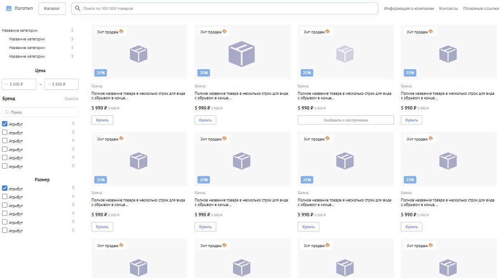
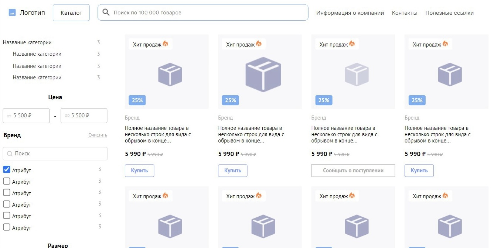
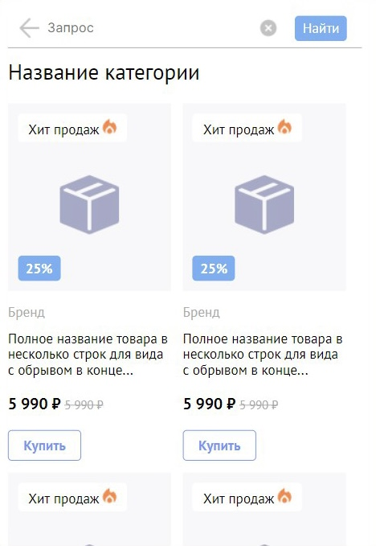

### Тестовое задание для компании Diginetica

#### Стек:
HTML, SCSS, Vite

#### Описание :
Вёрстка
Ссылка: https://www.figma.com/file/uBaU2XAC6gZqtshk59mMHL

Задание: необходимо сверстать данный макет.
Оцениваться будет соответствие макету и модульность.

Плюсом будет: интерактивность (стили элементов при наведении и т.д.)

Использование UI-библиотек не приветствуется, т.к. это не покажет ваши навыки в вёрстке нестандартных кейсов.

CSS-препроцессоры использовать можно. У нас в команде мы используем SCSS поэтому он будет в приоритете.

